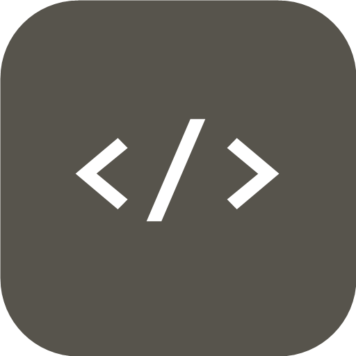

<p align="center">
  
</p>

<h1 align="center">OpenUI</h1>

<p align="center">Like browser F12 — but your edits write back to the source.</p>

OpenUI is a desktop visual editor for front-end projects. Open a folder, inspect
any element the way you would in devtools, and OpenUI points you at the exact
file and line it came from. Adjust it in a panel or describe the change to an
AI — the edit lands in your real source, not a throwaway devtools overlay.

## What's different

- **Pixel-to-source.** Click an element in the live preview and jump to its
  `file:line:col`. No source maps, no guessing.
- **Edits persist.** Quick Edit patches color / size / spacing into the
  element's inline style in the original file, and never touches its logic.
- **AI edits, reviewed.** Select an element, say what you want, review the diff,
  apply. Works with any OpenAI-compatible endpoint.
- **No build step.** Point it at a static HTML / CSS / JS folder and go. An
  adapter layer leaves room for React / Vue.

## Install

Grab the latest `OpenUI-Setup-x.x.x.exe` from the [Releases](../../releases)
page and run it. Windows x64.

## Develop

```
npm install
npm run dev
```

Open a folder, toggle Inspect, click an element. Try the bundled
`sample-project/` for a full run-through.

## Release

Push a version tag — GitHub Actions builds and publishes the Windows installer
to Releases automatically:

```
git tag v0.1.0
git push origin v0.1.0
```

## How it works

OpenUI injects `data-openui-loc` markers into the served HTML (via
node-html-parser), so the preview webview reports the source position of
whatever you click. The Element tab is a Monaco viewer that follows your cursor
and locks on click; Quick Edit writes inline styles back to disk; AI Chat sends
the file plus the selected element to an LLM and applies the returned diff. A
framework-adapter layer keeps the inspector reusable once React / Vue injection
lands.

Electron + React + TypeScript. UI localized in 12 languages.
